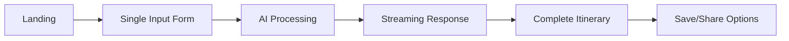
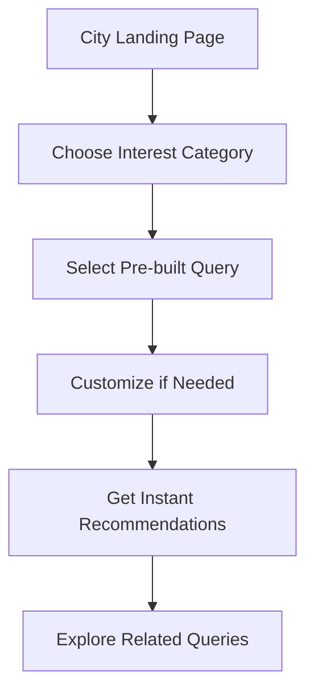

# AI Travel Platform - Product Specification

## Executive Summary

A dual-experience AI-powered travel platform that provides both open-ended trip planning and destination-specific exploration. Built on Gemini AI for intelligent itinerary generation with a focus on flexibility, discovery, and monetization through search integration.

---

## Product 1: Trip Builder (Open-Ended Planner)

### Overview
An AI-powered trip planning tool that allows users to describe ANY type of travel experience and receive a detailed, personalized itinerary. Unlike traditional planners that focus on single destinations, this tool embraces creativity - road trips, multi-city adventures, themed journeys, or vague ideas like "I want to see fall colors."

### Core Value Proposition
- **Flexibility First**: No rigid forms or prescribed paths
- **Natural Language**: Describe your dream trip in your own words
- **Intelligent Interpretation**: AI understands context, seasons, logistics
- **Comprehensive Output**: Full day-by-day itinerary with times, locations, and tips

### User Experience Flow



### Interface Design

#### Input Section
```
┌─────────────────────────────────────────────┐
│  Where do you want to go?                  │
│  ┌─────────────────────────────────────┐   │
│  │ Describe your trip...                │   │
│  │ "2 week road trip through New England│   │
│  │  to see fall colors"                  │   │
│  │ "Island hopping in Greece for 10 days"│   │
│  │ "Best ramen tour of Japan"            │   │
│  └─────────────────────────────────────┘   │
│                                             │
│  Duration: [====5 days====] (1-30 days)    │
│                                             │
│  Interests & Requirements (optional):       │
│  ┌─────────────────────────────────────┐   │
│  │ "Traveling with kids, need pools"     │   │
│  │ "Photography focused, golden hours"   │   │
│  └─────────────────────────────────────┘   │
│                                             │
│  Travel Style:                              │
│  [Budget] [Comfort] [Luxury]                │
│                                             │
│  [✨ Create My Journey]                     │
└─────────────────────────────────────────────┘
```

### Technical Architecture

#### API Request Structure (Gemini)
```javascript
const generateItinerary = async (userInput) => {
  const systemPrompt = `You are an expert travel planner who creates detailed,
    personalized itineraries. You understand context, logistics, seasons, and
    local customs. Create immersive, practical itineraries that balance must-see
    attractions with hidden gems. Include specific times, walking directions,
    and insider tips.`;

  const requestBody = {
    contents: [{
      role: "user",
      parts: [{
        text: `Create a detailed day-by-day itinerary for: ${userInput.description}
               Duration: ${userInput.duration} days
               Interests: ${userInput.interests}
               Style: ${userInput.style}

               Format each day with:
               - Morning (with specific times)
               - Afternoon activities
               - Evening plans
               - Where to eat (specific restaurants)
               - Logistics tips
               - Approximate costs`
      }]
    }],
    generationConfig: {
      temperature: 0.8,
      topK: 40,
      topP: 0.95,
      maxOutputTokens: 8192,
    },
    safetySettings: [
      {
        category: "HARM_CATEGORY_DANGEROUS_CONTENT",
        threshold: "BLOCK_ONLY_HIGH"
      }
    ]
  };

  const response = await fetch('https://generativelanguage.googleapis.com/v1beta/models/gemini-pro:generateContent', {
    method: 'POST',
    headers: {
      'Content-Type': 'application/json',
      'Authorization': `Bearer ${API_KEY}`
    },
    body: JSON.stringify(requestBody)
  });

  return response.json();
};
```

#### Streaming Implementation
```javascript
// Use Server-Sent Events for real-time streaming
const streamItinerary = async (userInput, onChunk) => {
  const response = await fetch('/api/generate-stream', {
    method: 'POST',
    body: JSON.stringify(userInput)
  });

  const reader = response.body.getReader();
  const decoder = new TextDecoder();

  while (true) {
    const { done, value } = await reader.read();
    if (done) break;

    const chunk = decoder.decode(value);
    onChunk(chunk); // Update UI with each chunk
  }
};
```

### Output Format

#### Structured Itinerary Display
```
Day 1: Boston Historic Beginning
━━━━━━━━━━━━━━━━━━━━━━━━━━━━━
🌅 Morning (8:00 AM - 12:00 PM)
• Start at Boston Common (8:00 AM)
• Walk Freedom Trail to State House (8:45 AM)
• Coffee at Thinking Cup (9:30 AM) - $5
• Continue to Faneuil Hall (10:00 AM)
• Explore Quincy Market (11:00 AM)

🌞 Afternoon (12:00 PM - 5:00 PM)
• Lunch at Union Oyster House - Historic seafood (12:00 PM) - $30-40
• Walk to North End (1:30 PM)
• Visit Paul Revere House (2:00 PM) - $6
• Gelato at Mike's Pastry (3:00 PM) - $8
• Explore Little Italy streets (3:30 PM)

🌙 Evening (5:00 PM - 10:00 PM)
• Sunset at Christopher Columbus Park (5:30 PM)
• Dinner at Giacomo's - No reservations, expect wait (6:30 PM) - $40-50
• Evening stroll along Harbor Walk (8:30 PM)

💡 Tips for Today:
- Wear comfortable walking shoes (3+ miles of walking)
- Buy Freedom Trail combo ticket in morning ($15)
- Giacomo's is cash only!

📍 Total Distance: 3.2 miles walking
💰 Estimated Cost: $95-120 per person
```

### Monetization Strategy

1. **Search Publisher Integration**
   - Embed Google Travel Products
   - Hotel booking affiliates (Booking.com, Hotels.com)
   - Activity bookings (Viator, GetYourGuide)
   - Flight search integration

2. **Premium Features**
   - Save unlimited itineraries
   - Export to PDF/calendar
   - Collaborative planning
   - Real-time pricing updates
   - Weather-adjusted recommendations

---

## Product 2: Destination Explorer (City-Specific)

### Overview
A focused, destination-specific planning tool that helps users explore a particular city or region with pre-populated queries and guided discovery.

### Core Value Proposition
- **Instant Inspiration**: Pre-written queries for common needs
- **Local Expertise**: Curated prompts from local knowledge
- **Quick Planning**: Fast answers to specific questions
- **Discovery Mode**: Explore aspects you hadn't considered

### User Experience Flow



### Interface Design

#### City Landing Page
```
┌─────────────────────────────────────────────┐
│  🗼 TOKYO TRAVEL GUIDE                      │
│  Your AI-Powered Local Expert                │
│                                             │
│  What would you like to explore?            │
│                                             │
│  ┌──────────┐ ┌──────────┐ ┌──────────┐   │
│  │   🍜     │ │    🏛️    │ │    🌃    │   │
│  │   Food   │ │  Culture  │ │Nightlife │   │
│  └──────────┘ └──────────┘ └──────────┘   │
│                                             │
│  ┌──────────┐ ┌──────────┐ ┌──────────┐   │
│  │   🚶     │ │    👨‍👩‍👧   │ │    💰    │   │
│  │  Walking │ │  Family   │ │  Budget  │   │
│  └──────────┘ └──────────┘ └──────────┘   │
│                                             │
│  Popular Queries:                           │
│  ┌─────────────────────────────────────┐   │
│  │ "Best ramen within walking distance  │   │
│  │  of Shibuya Station"                  │   │
│  ├─────────────────────────────────────┤   │
│  │ "3-hour evening itinerary in          │   │
│  │  Shinjuku for first-timers"           │   │
│  ├─────────────────────────────────────┤   │
│  │ "Hidden photography spots that        │   │
│  │  locals love"                         │   │
│  ├─────────────────────────────────────┤   │
│  │ "Traditional experiences under $50"   │   │
│  └─────────────────────────────────────┘   │
│                                             │
│  Or ask your own question:                  │
│  ┌─────────────────────────────────────┐   │
│  │ Type your question...                 │   │
│  └─────────────────────────────────────┘   │
└─────────────────────────────────────────────┘
```

### Pre-Populated Query Templates

#### Food Category
```javascript
const foodQueries = {
  "tokyo": [
    "Best ramen shops within 10 minutes of {location}",
    "Where do Tokyo salarymen eat lunch in {neighborhood}?",
    "Late-night food options near {station} after midnight",
    "Michelin-starred restaurants under ¥5000 for lunch",
    "Best depachika (food floors) for gourmet souvenirs",
    "Traditional breakfast spots that open before 7 AM",
    "Vegetarian-friendly izakayas in {area}",
    "Queue-worthy bakeries locals line up for"
  ]
};
```

#### Dynamic Query Builder
```javascript
const queryTemplates = {
  timeConstrained: "What can I do in {city} with only {hours} hours?",
  budgetFocused: "Best {category} experiences in {city} under {budget}",
  accessibility: "{city} attractions suitable for {accessibility_need}",
  seasonal: "What's special about {city} in {month}?",
  transitTime: "How to spend a {duration} layover in {city}",
  neighborhood: "Is {neighborhood} worth visiting? What's there?",
  comparison: "{attraction1} vs {attraction2} - which should I prioritize?",
  logistics: "How to get from {place1} to {place2} in {city}",
  timing: "Best time to visit {attraction} to avoid crowds",
  local: "Where do {city} locals go to {activity}?"
};
```

### Technical Implementation

#### Query Processing System
```javascript
class DestinationExplorer {
  constructor(city, geminiClient) {
    this.city = city;
    this.ai = geminiClient;
    this.context = this.loadCityContext(city);
  }

  async processQuery(query, category) {
    // Enhance query with city context
    const enhancedPrompt = `
      As a local expert for ${this.city}, answer this travel query:
      "${query}"

      Context:
      - Current season: ${this.getCurrentSeason()}
      - Popular events: ${this.context.currentEvents}
      - Local customs: ${this.context.customs}

      Provide:
      1. Direct answer to the question
      2. Specific recommendations with addresses
      3. Insider tips
      4. Related suggestions they might not have considered
      5. Practical logistics (opening hours, costs, reservations)
    `;

    const response = await this.ai.generate(enhancedPrompt);
    return this.formatResponse(response);
  }

  loadCityContext(city) {
    // Load city-specific knowledge base
    return {
      timezone: 'JST',
      currency: 'JPY',
      language: 'Japanese',
      currentEvents: this.fetchCurrentEvents(city),
      customs: this.getCulturalNotes(city),
      transportation: this.getTransportInfo(city),
      neighborhoods: this.getNeighborhoodData(city)
    };
  }
}
```

#### Response Caching Strategy
```javascript
// Cache popular queries for instant response
const cacheStrategy = {
  // Pre-generate responses for top queries
  pregenerateTopQueries: async (city) => {
    const topQueries = await getTopQueries(city);
    for (const query of topQueries) {
      const response = await generateResponse(query);
      await cache.set(`${city}:${query.id}`, response, '24h');
    }
  },

  // Smart cache invalidation
  invalidateOnChange: (city, changeType) => {
    if (changeType === 'seasonal') {
      cache.invalidatePattern(`${city}:seasonal:*`);
    }
    if (changeType === 'events') {
      cache.invalidatePattern(`${city}:events:*`);
    }
  }
};
```

### Monetization Features

#### Integrated Booking Flow
```javascript
const bookingIntegration = {
  hotels: {
    provider: 'Booking.com',
    affiliate_id: 'YOUR_ID',
    deeplink: (hotelId) => `https://booking.com/hotel/${hotelId}?aid=${affiliate_id}`
  },
  activities: {
    provider: 'Viator',
    apiKey: 'YOUR_KEY',
    searchNearby: async (lat, lon, category) => {
      // Return bookable activities
    }
  },
  restaurants: {
    provider: 'OpenTable',
    widget: (restaurantId, partySize, date) => {
      // Embedded reservation widget
    }
  }
};
```

---

## Shared Components

### AI Prompt Engineering

#### Master Instruction Set
```javascript
const masterInstructions = `
CORE PRINCIPLES:
1. You are a knowledgeable, enthusiastic local guide
2. Provide specific, actionable recommendations
3. Include practical details (costs, times, locations)
4. Balance tourist attractions with local gems
5. Consider logistics and realistic timing
6. Adapt to user's travel style and constraints

RESPONSE FORMAT:
- Use clear headings and structure
- Include emojis for visual scanning
- Provide specific addresses or landmarks
- Mention costs in local and USD
- Add insider tips in each section
- Suggest alternatives when applicable

AVOID:
- Generic travel clichés
- Overbooked tourist traps without warning
- Ignoring practical constraints
- Assuming unlimited budget
- Forgetting accessibility needs
`;
```

### UI Component Library

#### Core Design System
```css
:root {
  /* Colors */
  --primary: #2563eb;      /* Bright blue */
  --primary-dark: #1d4ed8;
  --secondary: #10b981;    /* Green */
  --accent: #f59e0b;       /* Amber */

  /* Semantic */
  --text-primary: #111827;
  --text-secondary: #6b7280;
  --border: #e5e7eb;
  --background: #ffffff;
  --surface: #f9fafb;

  /* Spacing */
  --space-xs: 0.25rem;
  --space-sm: 0.5rem;
  --space-md: 1rem;
  --space-lg: 1.5rem;
  --space-xl: 2rem;

  /* Typography */
  --font-sans: -apple-system, BlinkMacSystemFont, 'Segoe UI', sans-serif;
  --font-size-sm: 0.875rem;
  --font-size-base: 1rem;
  --font-size-lg: 1.125rem;
  --font-size-xl: 1.25rem;
  --font-size-2xl: 1.5rem;

  /* Borders & Shadows */
  --radius: 0.5rem;
  --shadow-sm: 0 1px 2px rgba(0, 0, 0, 0.05);
  --shadow-md: 0 4px 6px rgba(0, 0, 0, 0.1);
  --shadow-lg: 0 10px 15px rgba(0, 0, 0, 0.1);
}
```

#### Reusable Components
```javascript
// Loading State with Progress
const StreamingLoader = ({ progress }) => (
  <div className="streaming-loader">
    <div className="pulse-dot"></div>
    <div className="loading-text">
      {progress < 30 && "Analyzing your request..."}
      {progress >= 30 && progress < 60 && "Crafting your perfect itinerary..."}
      {progress >= 60 && progress < 90 && "Adding final touches..."}
      {progress >= 90 && "Almost ready..."}
    </div>
    <div className="progress-bar">
      <div className="progress-fill" style={{ width: `${progress}%` }}></div>
    </div>
  </div>
);

// Query Card Component
const QueryCard = ({ query, category, onClick }) => (
  <button className="query-card" onClick={() => onClick(query)}>
    <span className="category-emoji">{categoryEmojis[category]}</span>
    <span className="query-text">{query}</span>
    <span className="arrow">→</span>
  </button>
);

// Itinerary Day Component
const ItineraryDay = ({ day, number, activities }) => (
  <div className="itinerary-day">
    <div className="day-header">
      <span className="day-number">{number}</span>
      <h3 className="day-title">{day.title}</h3>
    </div>
    <div className="timeline">
      {activities.map((activity, i) => (
        <TimelineItem key={i} {...activity} />
      ))}
    </div>
  </div>
);
```

---

## Implementation Phases

### Phase 1: MVP (Week 1-2)
- [ ] Basic Trip Builder with Gemini integration
- [ ] Simple form input
- [ ] Basic itinerary generation
- [ ] Text-only output

### Phase 2: Enhanced UX (Week 3-4)
- [ ] Streaming responses
- [ ] Formatted itinerary display
- [ ] Save functionality
- [ ] Share links

### Phase 3: Destination Explorer (Week 5-6)
- [ ] City landing pages (start with 5 cities)
- [ ] Pre-populated queries
- [ ] Category filtering
- [ ] Query suggestions

### Phase 4: Monetization (Week 7-8)
- [ ] Google AdSense integration
- [ ] Affiliate link injection
- [ ] Booking widgets
- [ ] Premium feature gates

### Phase 5: Scale & Optimize (Week 9-10)
- [ ] Caching layer
- [ ] CDN setup
- [ ] Analytics dashboard
- [ ] A/B testing framework

---

## Success Metrics

### User Engagement
- **Primary**: Itineraries generated per day
- **Secondary**: Average session duration
- **Tertiary**: Return user rate

### Quality Metrics
- **Completion rate**: % who view full itinerary
- **Save rate**: % who save/email results
- **Share rate**: % who share with others

### Business Metrics
- **CPM**: Revenue per 1000 generations
- **Affiliate CTR**: Click-through to bookings
- **Conversion**: Free to premium upgrade rate

---

## Technical Requirements

### Infrastructure
```yaml
Backend:
  - Node.js 18+ / Python 3.10+
  - PostgreSQL for data persistence
  - Redis for caching
  - Gemini API for AI generation

Frontend:
  - React/Next.js or vanilla JavaScript
  - Tailwind CSS for styling
  - Server-sent events for streaming

Deployment:
  - Vercel/Railway/AWS
  - CloudFlare CDN
  - GitHub Actions CI/CD

Monitoring:
  - Sentry for error tracking
  - Mixpanel for analytics
  - CloudWatch for infrastructure
```

### API Rate Limits & Costs
```javascript
const rateLimits = {
  gemini: {
    requestsPerMinute: 60,
    tokensPerMinute: 60000,
    costPer1kTokens: 0.00025
  },

  estimatedCosts: {
    perItinerary: 0.02,  // ~8k tokens average
    perQuery: 0.005,     // ~2k tokens average
    monthlyBuffer: 100   // Safety margin
  }
};
```

---

## Risk Mitigation

### Technical Risks
1. **API Downtime**: Implement fallback to cached responses
2. **Rate Limiting**: Queue system with user notifications
3. **Cost Overrun**: Token counting and request throttling

### Business Risks
1. **Low Conversion**: A/B test different monetization placements
2. **Content Quality**: Human review queue for popular queries
3. **Competition**: Focus on unique features (flexibility, streaming)

---

## Appendix: Example Implementations

### Complete HTML Starter
```html
<!DOCTYPE html>
<html lang="en">
<head>
    <meta charset="UTF-8">
    <meta name="viewport" content="width=device-width, initial-scale=1.0">
    <title>AI Travel Planner</title>
    <style>
        /* Include design system CSS here */
    </style>
</head>
<body>
    <div id="app">
        <header class="header">
            <h1>Create Your Perfect Journey</h1>
        </header>

        <main class="container">
            <form id="tripForm" class="trip-form">
                <div class="form-group">
                    <label for="description">Where do you want to go?</label>
                    <textarea
                        id="description"
                        placeholder="Describe your dream trip..."
                        rows="4"
                    ></textarea>
                </div>

                <div class="form-group">
                    <label for="duration">Duration</label>
                    <input
                        type="range"
                        id="duration"
                        min="1"
                        max="30"
                        value="5"
                    />
                    <span id="durationValue">5 days</span>
                </div>

                <button type="submit" class="submit-btn">
                    Create My Journey
                </button>
            </form>

            <div id="results" class="results hidden">
                <!-- Results will be inserted here -->
            </div>
        </main>
    </div>

    <script>
        // Include JavaScript implementation here
    </script>
</body>
</html>
```

### Backend Endpoint Example
```javascript
// Express.js endpoint
app.post('/api/generate-itinerary', async (req, res) => {
  const { description, duration, interests, style } = req.body;

  try {
    // Initialize SSE
    res.writeHead(200, {
      'Content-Type': 'text/event-stream',
      'Cache-Control': 'no-cache',
      'Connection': 'keep-alive'
    });

    // Generate with Gemini
    const stream = await geminiClient.generateStream({
      prompt: buildPrompt(description, duration, interests, style),
      maxTokens: 8000,
      temperature: 0.8
    });

    // Stream chunks to client
    for await (const chunk of stream) {
      res.write(`data: ${JSON.stringify({ content: chunk })}\n\n`);
    }

    res.write('data: [DONE]\n\n');
    res.end();

  } catch (error) {
    console.error('Generation error:', error);
    res.status(500).json({ error: 'Generation failed' });
  }
});
```

---

This specification provides a complete blueprint for building both travel planning products with modern AI integration, monetization strategies, and scalable architecture.